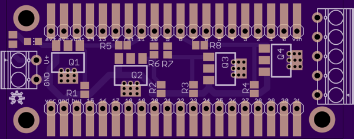
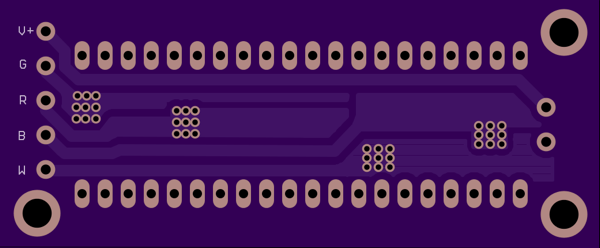

# RGBW LED Driver

A four channel LED driver board, designed for use with the Maple Mini
and other generic STM32F103 boards available on ebay and aliexpress. Shield
format, expecting PWM input from pins 8-11.

Shared on [OSH Park.](https://oshpark.com/shared_projects/4kCE6LhM)

 

## BOM

| Name           | Part                        |
|----------------|-----------------------------|
| Q1, Q2, Q3, Q4 | STN4NF03L N-Channel SOT-223 |
| R1, R2, R3, R4 | 0805 1M resistor            |
| R5, R6, R7, R8 | 0805 1k resistor            |

## Design notes
Polygon pours and thermal vias to help with any heat management issues.
Tested, board was produced by OSH Park. Designed to use the STN4NF03L
SOT-223 SMT N Channel MOSFET, but others could be substituted appropriately.
